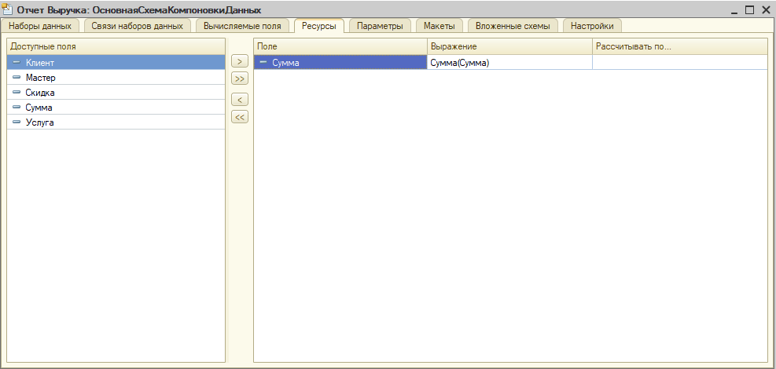

# Процесс выполнения

[Подготовка](#Подготовка)

[Установка свойств корня конфигурации](#Установка%20свойств%20корня%20конфигурации)

[Создание справочников и документа](#Создание%20справочников%20и%20документа)

[Создание константы и функциональной опции](#Создание%20константы%20и%20функциональной%20опции)

[Создание отчета](#Создание%20отчета)

[Создание ролей](#Создание%20ролей)

[Публикация на веб-сервере](#Публикация%20на%20веб-сервере)

[Ввод демо данных и тестирование](#Ввод%20демо%20данных%20и%20тестирование)

## Подготовка
Создайте новую информационную базу.

 
## Установка свойств корня конфигурации
Установите свойство Имя в значение "УправлениеПарикмахерскимСалоном".

Установите свойство Версия в значение "1.0.0.1".

Установите свойства Поставщик и Авторские права в значение, соответствующее вашему имени и фамилии.

Найдите наиболее подходящие картинки для Заставки и Логотипа, установите их в соответствующих свойствах.

 
## Создание справочников и документа
Создайте справочники "Мастера", "Клиенты", "Услуги", "Скидки". Корректно заполните свойство Представление объекта для каждого справочника. Для справочника "Клиенты" добавьте реквизит "Дата рождения" соответствующего типа.
Создайте документ "Стрижка". Корректно заполните свойство Представление списка. Добавьте реквизиты: "Клиент", "Услуга", "Скидка", "Мастер", "Сумма" соответствующих типов.

 
## Создание константы и функциональной опции
Создайте константу "ИспользоватьСкидки" с типом Булево. Создайте функциональную опцию "ИспользоватьСкидки", выберите Хранение: Костанта.ИспользоватьСкидки. Установите состав функциональной опции в соответствии со скриншотом:

## Создание отчета
1. Создайте новый отчет в конфигурации, установите имя **Выручка**
2. Создайте основную схему компоновки данных, нажав на кнопку "Открыть схему компопновки данных"
3. Добавьте единственный набор данных типа **Запрос** и откройте "Конструктор запроса"
4. В таблицу "Поля" перетащите нужные нам в отчете реквизиты документа **Стрижка**: **Клиент**, **Мастер**, **Услуга**, **Скидка**, **Сумма**. Нажмите Ок.

5. На закладке **Ресурсы** основной схемы компоновки данных перетащите поле **Сумма** из Доступных полей в список ресурсов.

6. Перейдите на закладку "Настройка" и под корнем "Отчет" добавьте группировку без указания поля группировки (конструктор назовет ее "Детальные записи"):

7. На закладке "Выбранные поля" перетащим вправо, из таблицы "Доступные поля", поля **Клиент**, **Мастер**, **Услуга**, **Скидка** и **Сумма**.
## Создание ролей
Создайте роль **ПолныеПрава**. Предоставьте все права с помощью команды Действия / Установить все права.

Установите флажок **Устанавливать права для новых объектов**.

Снимите права: 
- интерактивное удаление элементов справочников и документов;
- пометку на удаление и удаление помеченных предопределенных элементов.

Создайте роль АдминистраторРецепции:
- установите права на чтение справочников **Мастера**, **Услуги**, **Скидки**;
- установите права на добавление и изменение справочника **Клиенты** и документа **Стрижка**.

Создайте роль МастерСалона:
- установите права на чтение справочников **Мастера**, **Услуги**, **Скидки**, **Клиенты** и документа **Стрижка**.

## Публикация на веб-сервере
Выполните публикацию базы на веб-сервере. Способ публикации базы на веб-сервере подробно описан в одном из предыдущих домашних заданий.

По итогам публикации сделайте скриншоты базы в браузере с открытым окном "О программе". Пример скриншота:

## Ввод демо данных и тестирование
- Введите данные в соответствии с требованиями:
    - Создан пользователь Администратор с ролью ПолныеПрава;
    - Создан пользователь Администратор рецепции с ролью АдминистраторРецепции;
    - Создан пользователь Мастер салона с ролью МастерСалона;
    - В справочниках Мастера, Услуги, Клиенты введено хотя бы по 3 элемента;
    - В справочнике скидки введен хотя бы 1 элемент;
    - Создано хотя бы 3 документа Стрижка.
- Проверьте корректность отображения интерфейса под разными пользователями и в с разными настройками в соответствии с [контрольными примерами](test-cases.md).
