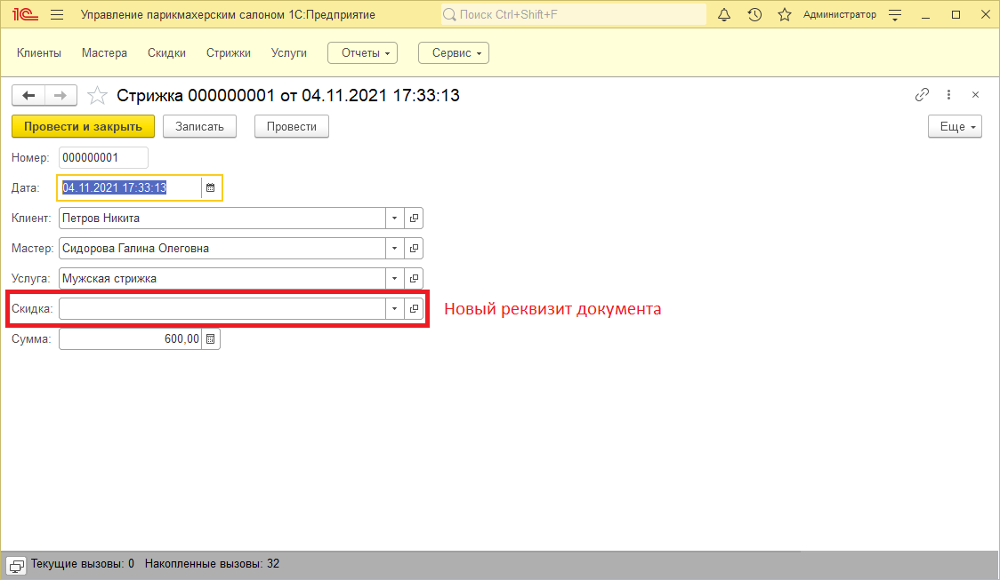

# Контрольные примеры
## Выключенная настройка "Использовать скидки"
Проверим, что константа **Использовать скидки** установлена в значение **Ложь**. После этого проверим интерфейс последовательно под всеми ролями.
### Администратор
Основной интерфейс + Справочник Мастера

Документ стрижка

### Администратор рецепции
Основной интерфейс + Справочник Мастера

Документ стрижка

### Мастер салона
Основной интерфейс + Справочник Мастера

Документ стрижка

## Включенная настройка "Использовать скидки"
Установим константу **Использовать скидки** в значение **Истина**. Проверим изменения интерфейса после включения настройки.
### Администратор
Основной интерфейс + Справочник Мастера

Документ стрижка

Отчет по выручке

